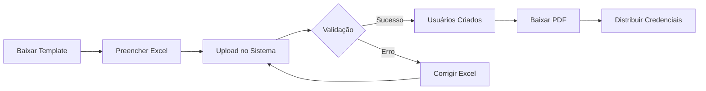

# 📚 Guia de Uso - Importação de Usuários e Gestão de Alunos/Professores

## 🎯 Visão Geral da Funcionalidade

Esta nova funcionalidade permite importar e gerenciar usuários (alunos e professores) através de:

1. **Importação via Excel (.xlsx)** - Importação em massa com geração automática de senhas
2. **Cadastro Manual** - Formulário completo com campos específicos
3. **Geração de PDF** - Credenciais em PDF para entrega aos usuários
4. **Conformidade LGPD** - Senhas criptografadas, PDFs temporários

---

## 🚀 Como Usar

### 1️⃣ Importação via Excel

#### Passo 1: Baixar o Template
1. Acesse: **Gerenciamento de Usuários** > **Importar Usuários**
2. Na seção "Importação via Excel", clique em **"Baixar Template Excel"**
3. Um arquivo `.xlsx` será baixado com as colunas:
   - **RA** (Registro Acadêmico)
   - **E-mail**

#### Passo 2: Preencher os Dados
- Abra o arquivo no Excel/LibreOffice
- Preencha uma linha por usuário
- Exemplo:
  ```
  RA        | E-mail
  123456    | joao.silva@escola.com
  789012    | maria.santos@escola.com
  ```

#### Passo 3: Fazer Upload
1. Selecione o **Tipo de Usuário** (Aluno ou Professor)
2. Clique em **"Escolher arquivo"** e selecione seu Excel
3. Clique em **"Processar Importação"**

#### Passo 4: Baixar PDF com Credenciais
- Após a importação bem-sucedida, um botão verde aparecerá
- Clique em **"Baixar PDF com Credenciais"**
- ⚠️ Este PDF contém as senhas em texto simples - guarde com segurança!

---

### 2️⃣ Cadastro Manual de Usuário

1. Acesse: **Gerenciamento de Usuários** > **Adicionar Usuário**
2. Preencha os campos:
   - **Nome Completo**
   - **Nome de Usuário** (login)
   - **RA** (opcional, mas recomendado)
   - **E-mail**
   - **Tipo de Usuário** (Aluno/Professor/Admin)
   - **Senha** e confirmação
   - Demais campos conforme necessário
3. Clique em **"Criar Usuário"**

---

### 3️⃣ Filtrar Usuários

Na página de listagem, você pode filtrar por:
- **Tipo**: Alunos, Professores, Administradores
- **Status**: Ativos, Inativos, Bloqueados
- **Busca**: Por nome, email, etc.

---

## 🔐 Segurança e LGPD

### Senhas Geradas Automaticamente
- **Comprimento**: 10 caracteres
- **Composição**: Letras maiúsculas, minúsculas, números e símbolos (!@#$%&*)
- **Criptografia**: Bcrypt no banco de dados
- **Exemplo de senha gerada**: `A7@bK9!mP2`

### Conformidade LGPD
✅ Senhas são criptografadas no banco de dados
✅ PDFs são gerados temporariamente (não armazenados no servidor)
✅ Credenciais são limpas da sessão após download do PDF
✅ Logs não contêm senhas em texto simples

---

## 📊 Estrutura de Dados

### Novos Campos na Tabela `users`

| Campo       | Tipo   | Descrição                          | Valores              |
|-------------|--------|------------------------------------|----------------------|
| `ra`        | string | Registro Acadêmico (único)         | Ex: "123456"         |
| `user_type` | enum   | Tipo de usuário                    | aluno, professor, admin |
| `status`    | enum   | Status do usuário                  | ativo, inativo, bloqueado |

---

## 🛠️ Arquivos Criados/Modificados

### Backend (PHP/Laravel)

#### Services
- `app/Services/UserImportService.php` - Lógica de importação Excel
- `app/Services/UserCredentialsPdfService.php` - Geração de PDFs

#### Controllers
- `app/Http/Controllers/Opnsense/Auth/UserController.php` (atualizado)
  - `downloadExcelTemplate()` - Download do template
  - `processExcelImport()` - Processar upload
  - `downloadCredentialsPdf()` - Gerar PDF
  - `store()` - Atualizado para novos campos

#### Models
- `app/Models/User.php` (atualizado)
  - Adicionados campos: `ra`, `user_type`, `status`
  - Constantes para tipos e status

#### Migrations
- `database/migrations/2025_10_18_182440_add_user_fields_to_users_table.php`

#### Routes
- `routes/web.php` (atualizado)
  - `/users/import/excel/template` - Template
  - `/users/import/excel/process` - Upload
  - `/users/import/excel/credentials-pdf` - PDF

### Frontend (Blade Templates)

#### Views
- `resources/views/users/import.blade.php` (atualizado)
  - Seção de importação Excel adicionada
- `resources/views/users/create.blade.php` (atualizado)
  - Campos RA e Tipo de Usuário
- `resources/views/users/index.blade.php` (atualizado)
  - Filtros por tipo e status
- `resources/views/pdf/user-credentials.blade.php` (novo)
  - Template do PDF de credenciais

### Dependências Instaladas
```json
{
  "maatwebsite/excel": "^3.1",      // Importação/Exportação Excel
  "barryvdh/laravel-dompdf": "^3.1" // Geração de PDFs
}
```

---

## 🧪 Testando a Funcionalidade

### Teste 1: Importação Básica
1. Baixe o template
2. Adicione 3 usuários de teste
3. Importe como "Alunos"
4. Verifique se todos foram criados
5. Baixe o PDF e confira as credenciais

### Teste 2: Validações
Teste os seguintes cenários (devem dar erro):
- ❌ RA duplicado
- ❌ E-mail duplicado
- ❌ E-mail inválido
- ❌ Linha vazia no meio do arquivo

### Teste 3: Cadastro Manual
1. Crie um professor manualmente
2. Preencha o RA
3. Verifique se aparece na listagem
4. Teste os filtros

---

## ⚠️ Erros Comuns e Soluções

### Erro: "RA já existe no sistema"
**Causa**: Tentativa de importar um RA já cadastrado
**Solução**: Verifique o Excel e remova duplicatas

### Erro: "E-mail inválido ou vazio"
**Causa**: Formato de e-mail incorreto
**Solução**: Corrija o formato (exemplo@dominio.com)

### Erro: "Nenhuma credencial disponível para gerar PDF"
**Causa**: Sessão expirou ou PDF já foi baixado
**Solução**: Faça uma nova importação

### Excel não abre corretamente
**Causa**: Arquivo corrompido ou versão incompatível
**Solução**: Baixe novamente o template

---

## 📝 Exemplo de Fluxo Completo



---

## 🔄 Próximas Melhorias (Opcionais)

- [ ] Envio automático de e-mail com credenciais
- [ ] Validação de domínio de e-mail institucional
- [ ] Importação com foto/avatar
- [ ] Exportação de usuários para Excel
- [ ] Histórico de importações
- [ ] Agendamento de desativação automática

---

## 📞 Suporte

Em caso de dúvidas ou problemas:
1. Verifique os logs em `storage/logs/laravel.log`
2. Consulte este guia
3. Entre em contato com o desenvolvedor

---

**Data de criação desta documentação**: 18/10/2025
**Versão**: 1.0
**Autor**: Sistema OPNsense Web UI
